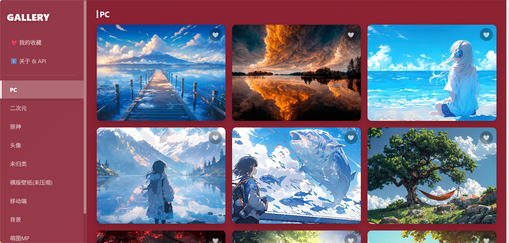

# ImagesGallery

基于图片公链调用的 PHP 图片网站，支持多分类图片浏览、下载及 API 调用。

演示：旧版https://t.ziworld.top/index-v1.php
      v2版 https://t.ziworld.top/

#  环境要求

PHP 7.0+

# 使用
## 创建分类

在**categories**文件夹中创建 **分类名.txt** 的文件(可以使用中文)

 **分类名.txt** 中存储图片公链链接，一行一个

## 配置

在**index.php**中配置

```php
$CATEGORY_DIR = 'categories'; // 存放分类txt文件的目录

$SITE_TITLE = '图片公链存储'; // 网站标题 (此版本中不再直接显示)

$DEFAULT_CATEGORY = 'PC'; // 默认展示的分类

$THUMB_SIZE = 300; // 缩略图大小（主要用于Unsplash URL参数，非服务器端处理）
```

## api

**api/index.php**中配置

```php
$category_dir = '../categories'; // 分类目录
$default_category = 'PC'; // 默认分类
```

使用：[说明文档 - 图片公链存储 API](https://t.ziworld.top/api/readme.html)

效果图：


---
## v2版本

优化了界面和加载速度，新增图片收藏等功能




